# GREENROOM — Phase 0 Plan

> Working codename only — run a trademark search before public launch.

This document covers architecture, repo layout, decisions made where the
master build prompt left options open, open questions for the founder, the
Phase 0 task list, and top technical risks. **No application code is written
yet.** Per the kickoff instructions, this plan waits for explicit approval
("approved") before Phase 0 implementation begins.

---

## 1. Architecture Diagram

```mermaid
flowchart TB
    subgraph Inbound["Inbound Channels"]
        Gmail["Gmail API\n(push via Pub/Sub)"]
        IG["Instagram DMs\n(webhooks, Phase 3)"]
        Intake["Smart Intake Page\n(public, per-brand)"]
    end

    subgraph API["FastAPI Backend"]
        Ingest["Ingestion Layer\n(EmailProvider / DMProvider adapters)"]
        Orchestrator["Agent Orchestrator"]
        subgraph Agents["Specialist Agents (LLMProvider)"]
            Triage["Triage Agent"]
            BrandVoice["Brand Voice Agent"]
            DealDesk["Deal Desk Agent"]
            Contracts["Contracts Agent"]
            Prospector["Prospector Agent"]
            OutreachWriter["Outreach Writer Agent"]
            Scheduler["Scheduler Agent"]
            Briefing["Briefing Agent"]
        end
        Policy["Policy Engine\n(plain code, ALLOW/REQUIRE_APPROVAL/DENY)"]
        Audit["Audit Log (append-only)"]
    end

    subgraph Data["Data Layer"]
        Mongo[("MongoDB Atlas\n+ Vector Search")]
        Redis[("Redis")]
    end

    subgraph Workers["Background Jobs (ARQ)"]
        FollowUps["Follow-up timers"]
        Sequences["Outreach sequence steps"]
        Scoring["Lead scoring / enrichment"]
    end

    subgraph External["External Services (behind interfaces)"]
        Anthropic["Anthropic API (LLMProvider)"]
        Voyage["Voyage AI (EmbeddingProvider)"]
        SearchAPI["Tavily (SearchProvider)"]
        GCal["Google Calendar"]
        Stripe["Stripe"]
        SearchDirs["CDE / NCES school directories"]
    end

    subgraph Frontend["React PWA (mobile-first)"]
        Approvals["Approvals queue"]
        Today["Today / Daily Brief"]
        Pipeline["Pipeline kanban"]
        BrandBrainUI["Brand Brain editor"]
    end

    Gmail --> Ingest
    IG --> Ingest
    Intake --> Ingest
    Ingest --> Orchestrator
    Orchestrator --> Triage --> Policy
    Orchestrator --> BrandVoice --> Policy
    Orchestrator --> DealDesk --> Policy
    Orchestrator --> Contracts --> Policy
    Orchestrator --> Prospector --> Policy
    Orchestrator --> OutreachWriter --> Policy
    Orchestrator --> Scheduler --> Policy
    Orchestrator --> Briefing
    Agents <--> Anthropic
    Agents <--> Voyage
    Agents <--> SearchAPI
    Prospector --> SearchDirs

    Policy --> Audit
    Policy -- "ALLOW / auto-send (autonomy ladder)" --> Ingest
    Policy -- "REQUIRE_APPROVAL" --> Approvals
    Approvals -- "approve / edit / adjust / send" --> Orchestrator

    Orchestrator <--> Mongo
    Orchestrator <--> Redis
    Redis <--> Workers
    Workers <--> Mongo
    Scheduler <--> GCal
    API --> Stripe

    Frontend <--> API
```



---

## 2. Repo Structure

```
/api
  /app
    /agents          # one module per specialist agent (Section 5)
    /core
      config.py       # pydantic-settings, one place for env vars
      security.py      # JWT, password hashing, RBAC deps
      policy_engine.py # ALLOW / REQUIRE_APPROVAL / DENY logic
      tracing.py        # LLM call tracing (Langfuse client)
    /models            # Beanie documents (Section 7 collections)
    /providers          # LLMProvider, EmbeddingProvider, SearchProvider,
                         # EmailProvider, DMProvider, OutreachSender —
                         # interface + concrete adapter per file
    /routers            # FastAPI route modules, one per resource
    /services            # business logic orchestrating models + providers
    /workers               # ARQ task functions
    main.py
  /tests                   # pytest, one dir mirroring /app
  /evals
    /fixtures               # eval_cases as YAML/JSON
    runner.py
  pyproject.toml
  Dockerfile

/web
  /src
    /pages                  # Today, Approvals, Inbox, Pipeline, ... (Section 12)
    /components
    /lib                     # API client, auth, push notifications
  package.json
  vite.config.ts
  Dockerfile

/docs
  SCOPES.md                  # documented OAuth scopes per integration
  LEGAL_REVIEW.md
  ARCHITECTURE.md            # optional deeper-dive beyond this plan

/seed
  /voice_samples              # founder pastes real emails here (Section 16)
  demo_workspace.py            # seed script entrypoint

/scripts                       # one-off ops scripts

docker-compose.yml              # api, worker, web, mongo, redis
Makefile                        # dev, test, eval, seed
.env.example
CHANGELOG.md
DEMO.md                          # written at the end of each phase
PLAN.md
README.md
```

---

## 3. Decisions Made (where the brief gave options)

| Area | Decision | Why |
|---|---|---|
| ODM | **Beanie** over raw Motor | Pydantic v2-native document models match the rest of the stack (Pydantic everywhere for agent I/O too); less boilerplate for multi-tenant query scoping. |
| SearchProvider | **Tavily** | Purpose-built for LLM-agent retrieval (structured, citation-friendly results), reasonable pricing at low volume; swappable behind `SearchProvider` if it doesn't hold up. |
| LLM trace store | **Self-hosted Langfuse** | Open source, first-class Anthropic/OpenTelemetry support, avoids a new paid vendor before Section 6 approval is needed. |
| Workflow durability | ARQ now, **interface-compatible with a later Temporal move** | Matches principle 8 (boring infra); ARQ is enough for Phase 0-5 job volume, but agent/job boundaries are drawn so timers and sequence steps could be lifted into Temporal workflows later without touching agent logic. |
| Deploy target | **Railway** for API + worker (tentative) | Single-dashboard multi-service deploys (api, worker, redis) with less ops overhead than Render for a solo founder-operator; flagged as an open question below since this is reversible and cheap to change. |
| Gmail scope strategy (Phase 0-5) | **Google Workspace Internal app** for customer zero | Avoids OAuth verification/CASA entirely until Phase 6; `EmailProvider` interface keeps a Nylas/Unipile adapter as a drop-in swap for multi-tenant launch. |
| RBAC roles | Implemented exactly as specified (`owner`, `manager`, `assistant`, `viewer`) in Phase 0, even though only `owner` is used until Phase 6 | Cheaper to model correctly now than retrofit workspace-scoped permission checks later. |
| Model config | Single `config/models.py` mapping tier → model ID, values from Section 5 as the initial default | Will be verified against docs.claude.com at Phase 0 implementation time per the brief's instruction, not hardcoded blindly. |
| UI design direction | **ChatGPT-style: simple, elegant, minimal** — clean sans-serif (Inter, matching the `system-ui` stack ChatGPT itself uses), generous whitespace, near-monochrome neutral palette with a single accent color, light/dark parity — overriding Section 12's "premium green-room/backstage" direction per your request | You asked for this explicitly; it's also a better fit for an approvals-queue-first, mobile-speed product (Section 4.3.3's "as fast as clearing notifications" goal) than a heavier entertainment-industry aesthetic. `shadcn/ui` (already chosen in Section 6) is a natural fit for this look with no extra dependency. |

---

## 4. Open Questions for You

1. **Gmail account type:** Is your primary inbox on Google Workspace (custom domain) or personal Gmail? This determines whether we can configure the OAuth app as Internal (no verification needed) starting Phase 1.
2. **Deploy host:** Railway or Render for API + worker — any existing account/preference, or should I proceed with Railway per my tentative decision above?
3. **Domains:** Do you already own (a) your primary brand domain and (b) a separate domain for cold outreach (required by Section 8.3, never the primary domain)? Needed by Phase 4.
4. **Section 16 Brand Brain seed:** Will you fill in `PLAN.md` §16 / the YAML seed before Phase 1 starts, or should Phase 0 create `/seed/brand_brain_seed.yaml` as a placeholder for you to edit afterward?
5. **Voice samples:** Do you have 20-50 real emails you've written available to drop into `/seed/voice_samples/` before Phase 1's voice-consistency work starts?
6. **Stripe:** Existing Stripe account for this business, or does one need to be created?
7. **Instagram:** Do you have an Instagram Business/Creator account ready to go through Meta API review? Meta review can take weeks — worth starting early even though it's a Phase 3 feature.
8. **Team/RBAC testing:** Will anyone besides you use the product at launch (an assistant or manager), or is it solo through Phase 5? Affects how much to invest in role-based UI now vs. later.
9. **Hard deadlines:** Any investor demo date or other fixed milestone that should influence phase pacing (e.g., compress Phase 1-2, delay Prospector)?
10. **SearchProvider budget:** Comfortable starting with Tavily's paid tier (low cost, usage-based), or is there a search API you already have access to that I should use instead?

---

## 5. Phase 0 Task List & Estimates

| # | Task | Est. |
|---|---|---|
| 1 | Repo scaffolding: FastAPI backend, Vite/React/TS frontend, Docker Compose (api, worker, web, mongo, redis) | 1d |
| 2 | GitHub Actions CI: ruff, eslint, mypy, tsc, pytest, `make eval` gate | 0.5d |
| 3 | Config system: `config/models.py`, `pydantic-settings`-based env loading, `.env.example` | 0.5d |
| 4 | Auth + RBAC: JWT access/refresh, Google sign-in, `owner/manager/assistant/viewer` roles, workspace-isolation dependency | 1.5d |
| 5 | Core data models: `workspaces`, `users`, `brands` (Beanie documents), multi-tenant `workspace_id` scoping helper | 1d |
| 6 | `LLMProvider` interface + Anthropic implementation, prompt-caching support, Langfuse tracing wired into every call | 1d |
| 7 | Policy Engine skeleton: `ALLOW / REQUIRE_APPROVAL / DENY`, autonomy-level stub (defaults to L0 everywhere), decision logging | 1d |
| 8 | Append-only `audit_log` collection + write helper used by policy engine and auth | 0.5d |
| 9 | Eval harness skeleton (`/evals/runner.py`, fixture schema) + 10 starter fixtures spanning triage/guardrail cases, `make eval` | 1d |
| 10 | Seed script: fake demo workspace, demo brand, sample threads/opportunities for local dev | 0.5d |
| 11 | `docs/SCOPES.md` stub, `docs/LEGAL_REVIEW.md` stub, `README.md` dev instructions | 0.5d |

**Total: ~9 engineering days.**

Acceptance criteria (per Section 15): `make dev` runs everything locally; `make test` and `make eval` pass; demo workspace loads.

---

## 6. Top 5 Technical Risks

1. **Gmail multi-tenant OAuth verification (CASA assessment).** Restricted scopes require annual third-party security review before onboarding creators beyond the founder. *Mitigation:* stay on an Internal Workspace app through Phase 5; keep `EmailProvider` swappable to a pre-verified vendor (Nylas/Unipile) evaluated before Phase 6 rather than pursuing verification ourselves.
2. **LLM cost/latency for multi-option generation.** Every actionable thread needs 2-4 distinct, policy-checked options within 60 seconds (Phase 1 acceptance criterion) — this is several LLM calls per message. *Mitigation:* prompt caching on the Brand Brain context block, cheap-tier triage before invoking Brand Voice, async generation with the approval queue polling rather than blocking on a single request.
3. **Prompt injection from untrusted inbound content.** Emails/DMs/attachments are adversarial by default (Section 2, principle 3). *Mitigation:* strict `READ`/`DRAFT`/`SIDE_EFFECT`/`NEVER` tool classes enforced in code (not prompts), Policy Engine as the sole gate on side effects, dedicated injection fixtures in the eval suite from Phase 0 onward.
4. **Instagram/Meta platform risk.** API review timelines, the 24-hour messaging window, and policy changes are outside our control. *Mitigation:* sequence Instagram to Phase 3 only, keep `DMProvider` behind an interface, don't let core roadmap (Phases 1-2) depend on it; start Meta app review early once an Instagram Business account is confirmed (see Open Question 7).
5. **Solo-founder maintenance surface.** The full spec is large (13+ integrations, 8 agents, negotiation engine, prospecting, deliverability infra). *Mitigation:* hard phase gate discipline — no work starts on a phase until the prior phase's acceptance criteria pass and are reviewed; "boring, reliable technology" principle applied literally to every infra choice above; defer anything not required for customer-zero's real business (e.g., multi-tenant polish) to Phase 6.

---

## 7. Addendum: SMS Channel (added after initial approval)

You asked for iPhone text messages to live in the same inbox as email, tagged
by channel, with reply options for both. Two notes and a decision:

- **True iMessage (blue bubble) has no third-party API** — Apple doesn't
  expose one. The reliable, compliant path is a **dedicated business SMS/MMS
  number via Twilio**: two-way texting that arrives as a normal text thread
  on your iPhone (green bubble, sent from your business number), not your
  personal number.
- This is a new paid vendor not in the original Section 6 list — flagging
  per principle 5, but treating your request as approval to proceed with
  Twilio specifically. Say so if you'd rather I hold off or use a different
  vendor.
- **Data model:** `threads.channel` (Section 7) extends to `email | sms |
  dm | intake`. `messages.direction` and the reply-option/approval flow
  (Section 4.3) are channel-agnostic already — an SMS thread gets the same
  triage card and option-set treatment as email, just shorter drafts and a
  `SMSProvider` adapter (mirroring `EmailProvider`) for send/receive.
- **Sequencing:** promoted to ship alongside Gmail in **Phase 1** (not
  deferred like Instagram) since it's core to "know what's an email vs a
  text, respond either way" being in the app from the start.

This doesn't change Phase 0 scope — Phase 0 is channel-agnostic foundation
(auth, data models, policy engine, LLM provider). SMS ingestion/sending
lands when Phase 1 is scoped in detail.

---

## Next Step

Waiting for your review of the decisions and answers to the open questions
above (or explicit approval to proceed with my tentative choices). Once you
reply **"approved,"** Phase 0 implementation begins per the task list in
Section 5.
